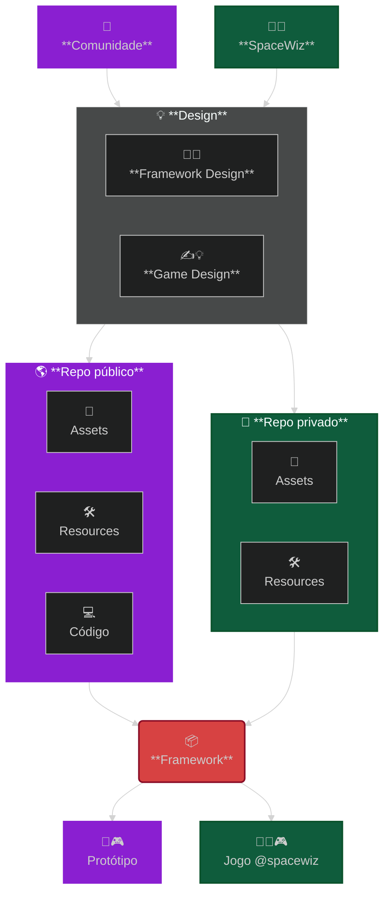

# FIREBOUND FRAMEWORK

[](https://github.com/Space-Wizard-Studios/sw-game-dice-rolling/blob/main/LICENSE)  [](https://sonarcloud.io/summary/new_code?id=Space-Wizard-Studios_sw-game-dice-rolling) 

- [FIREBOUND FRAMEWORK](#firebound-framework)
  - [Sumário](#sumário)
  - [Sobre](#sobre)
    - [Por que código aberto?](#por-que-código-aberto)
    - [E por que os assets não são abertos?](#e-por-que-os-assets-não-são-abertos)
  - [Links](#links)
  - [Estrutura de arquivos](#estrutura-de-arquivos)
  - [Contribuições e Código de Conduta](#contribuições-e-código-de-conduta)
  - [Licença](#licença)

---

## Sobre

Este é um projeto de código aberto para o desenvolvimento de uma framework para criação de jogos no estilo [Roguelike](https://en.wikipedia.org/wiki/Roguelike) com batalha por turnos, feita em C# na [Godot Engine](https://godotengine.org/).

Os objetivos são:

1. Criar uma **Framework** modular e aberta que permita a quaisquer desenvolvedores, artistas, estudantes ou curiosos a [clonarem e fazer alterações no código base](CONTRIBUTING.md).

2. Desenvolver um **Protótipo** que utilize a **Framework** e que possa ser usado como base para outros jogos, mods e afins.

3. Criar um **Jogo completo** da **Space Wizard Studios** que utilize a **Framework** e que possa ser publicado em plataformas de distribuição.

A premissa deste projeto é que tanto o design da **Framework** quanto do **Jogo** serão guiados pela comunidade, porém, a produção dos assets usados no jogo (áudios, imagens etc.) será realizada de forma independente e o jogo final será publicado em plataformas de distribuição como Steam, itch.io, etc. (ainda a ser definido).



<!-- markdownlint-disable MD033 -->

<details>

<summary>Nossa política de código aberto</summary>

### Por que código aberto?

Acreditamos que a colaboração e a transparência são essenciais para o desenvolvimento de softwares de qualidade. Esses sempre foram nossos valores em projetos desenvolvidos para clientes e queremos manter isso em nosso próprio projeto.

Por isso, decidimos desde o começo em manter o código do nosso projeto aberto para que qualquer pessoa possa contribuir, aprender, ensinar e se divertir com a gente.

### E por que os assets não são abertos?

Queremos manter a qualidade, coerência artística e, também, desenvolver a nossa própria visão do jogo. Por isso a produção dos assets será feita de forma independente (mas sempre recebendo feedbacks!).

Isso significa que os áudios, imagens e outros recursos que não sejam parte do protótipo **não estarão disponíveis neste repositório**.

</details>

<!-- markdownlint-enable MD033 -->

---

## Links

[Documentação](https://space-wizard-studios.github.io/firebound/) (em construção)

---

## Estrutura de arquivos

```powershell
.
├── docs                    # Documentação no Docusaurus
└── src                     # Projeto na Godot Engine
```

Para mais detalhes, leia sobre a [framework](src/README.md) ou a [documentação](docs/README.md).

## Contribuições e Código de Conduta

Se você deseja contribuir com o projeto, leia o nosso [Guia de Contribuição](CONTRIBUTING.md).

Este projeto e todos os participantes são regidos pelo nosso [Código de Conduta](CODE_OF_CONDUCT.md). Ao participar, você deve seguir este código.

## Licença

Todo o código deste projeto é licenciado sob a licença MIT - veja o arquivo [LICENSE](LICENSE) para mais detalhes.

Os assets são licenciados sob a licença [CC BY-NC-ND 4.0](https://creativecommons.org/licenses/by-nc-nd/4.0) a menos que especificado de outra forma.
