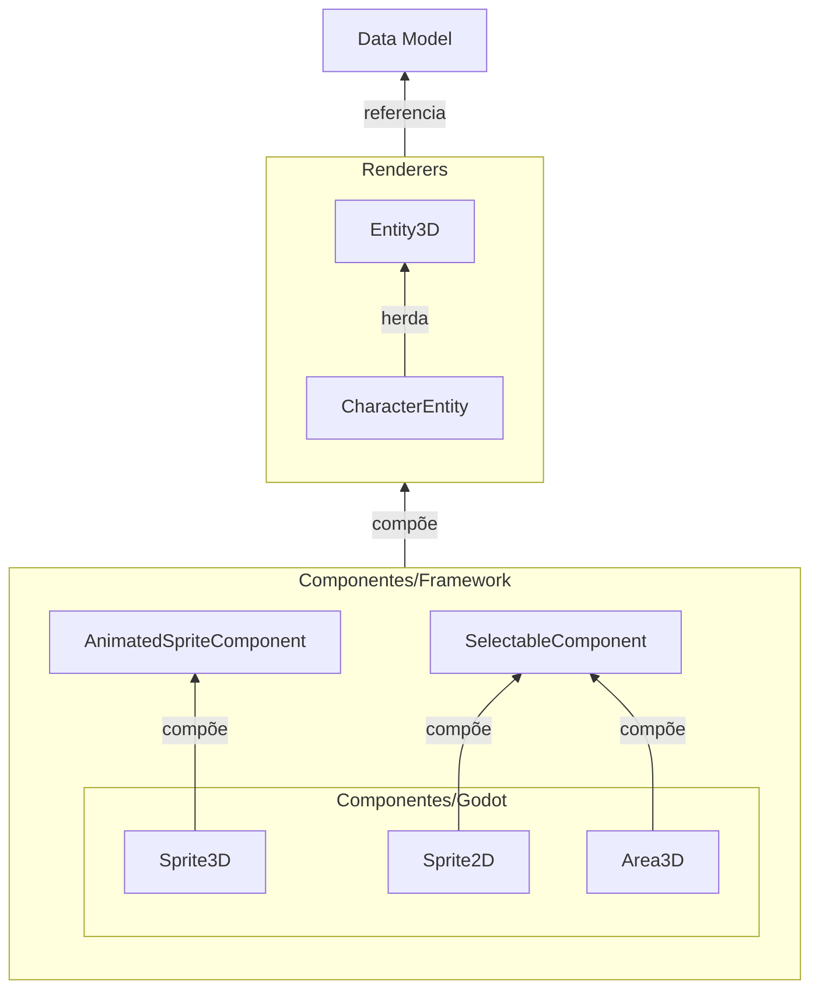

# Visão Geral

---

## Resumo da Arquitetura

A arquitetura desta framework é projetada para oferecer **flexibilidade e modularidade**, permitindo modificações e expansões sem impacto direto em outras partes do sistema.

A ideia é ter uma arquitetura baseada em Modelos, Renderizadores, Controladores e Eventos, que são organizados em camadas para facilitar a manutenção e a expansão do código.

Dessa forma, a **lógica do jogo** é centralizada nos Controladores, a **representação visual** é feita pelos Renderizadores e os **dados do jogo** são gerenciados pelos Modelos:

1. Os **Modelos** armazenam e gerenciam os dados do jogo, estruturados em três camadas: Data, Services e Stores;
2. Os **Renderizadores** representam os dados em elementos visuais;
3. Os **Controladores** gerenciam estados, cenas e eventos;
4. A comunicação entre os sistemas é feita por **Eventos**, que permitem a interação entre Modelos, Visualizações e Controladores.

---

## Modelos de dados

Os Modelos são estruturados em `Resources` do Godot, possibilitando expansão como a criação de novos tipos de personagens, atributos, classes, ações e efeitos com o mínimo de alterações no código.

São estruturados em três camadas:

- **Data**: definem **como** os `Resources` são estruturados, incluindo suas propriedades;
- **Services**: Manipulam os dados das `Stores` e implementam regras de negócio, garantindo consistência na lógica da aplicação.
- **Stores**: Armazenam os dados em tempo de execução, mantendo o estado global do jogo e sincronizando as mudanças entre diferentes partes do sistema.

### Resources

Atualmente, os tipos de `Resources` ainda estão sendo definidos e por enquanto, existe apenas um para cada modelo.

Por isso o acesso e manipulação desses tipos está sendo feito diretamente.

:::info Explicação

- `CharacterType` é um tipo de **Resource** que implementa a interface `ICharacter`.
- `CharacterService` manipula `CharacterType`.
- `CharacterStore` armazena `CharacterType`.

:::

:::tip Dica

Para entender melhor o conceito de **Resource**, veja o [tutorial](https://docs.godotengine.org/en/stable/tutorials/scripting/resources.html) e a [documentação oficial](https://docs.godotengine.org/en/stable/classes/class_resource.html) do Godot.

:::

#### Abstração dos Resources

Quando novos tipos de **Resources** forem criados para uma mesma _feature_ (por exemplo, `CharacterTypeA` e `CharacterTypeB`), será necessário que essas classes herdem de uma classe base como `CharacterBase`.

:::info Explicação

- `CharacterTypeA` e `CharacterTypeB` são **Resources** que herdam `CharacterBase`.
- `CharacterBase` é a classe base que implementa `ICharacter`.
- `CharacterService` manipula dados do tipo `CharacterBase`.
- `CharacterStore` armazena dados do tipo `CharacterBase`.

:::

---

## Renderizadores

Os **Renderizadores** são responsáveis pela exibição gráfica dos elementos do jogo, usando os dados dos `Models` para criar representações visuais (incluindo animações e efeitos) através de Componentes modulares.

### Componentes

Os **Componentes** compõem os **Renderizadores**, encapsulando funcionalidades específicas, como animações e interações visuais. Eles promovem modularidade e flexibilidade no desenvolvimento.

---

## Controladores

Os **Controladores** centralizam a lógica do jogo, gerenciando estados, cenas e eventos.

Coordenam as ações dos jogadores e interações entre personagens, garantindo que a progressão e os sistemas do jogo funcionem corretamente.
