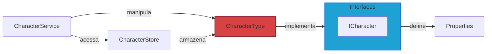
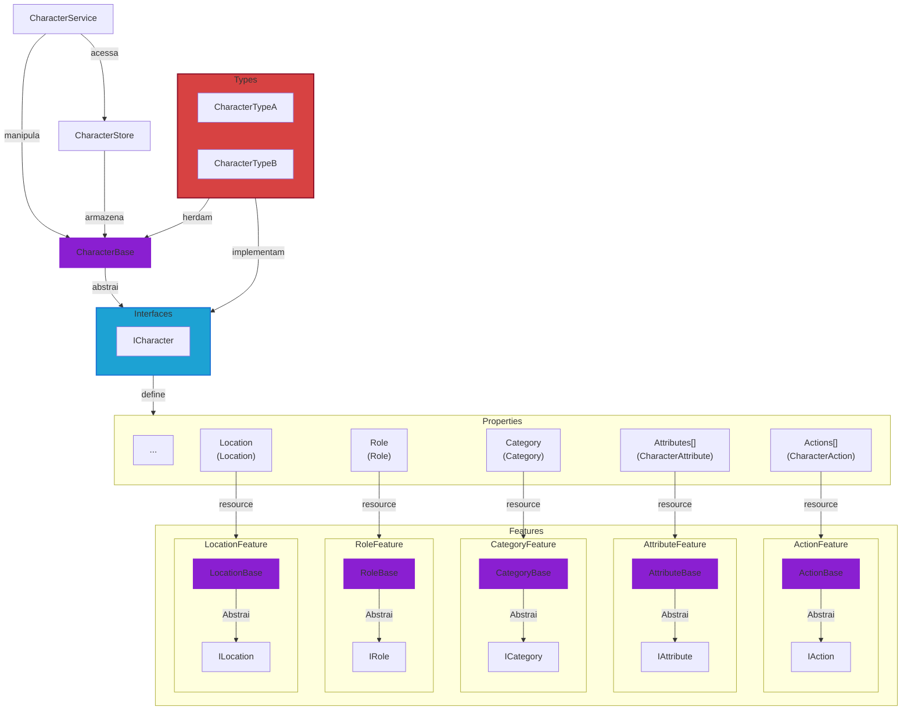

# Resources

Até o momento a tipagem das features ainda estão sendo definidas e, por isso, existe basicamente um tipo de Resource para cada feature.

Para um melhor entendimento do que é um Resource, veja o [tutorial](https://docs.godotengine.org/en/stable/tutorials/scripting/resources.html) e a [documentação](https://docs.godotengine.org/en/stable/classes/class_resource.html) do Godot.

Então a manipulação dos Resources até o momento está sendo feita diretamente.

:::info

`CharacterType` é o tipo de Resource para a feature `Character`.

`CharacterService` manipula `CharacterType` e `CharacterStore` armazena `CharacterType`.

:::

## Abstração

A partir do momento que novos tipos de recursos forem criados para uma mesma feature, como `CharacterTypeA` e `CharacterTypeB`, será necessário que essas classes herdem uma classe abstrata como `CharacterBase`.

No gráfico abaixo, `CharacterBase` é a classe herdada e que abstrai as interfaces de `ICharacter`.

