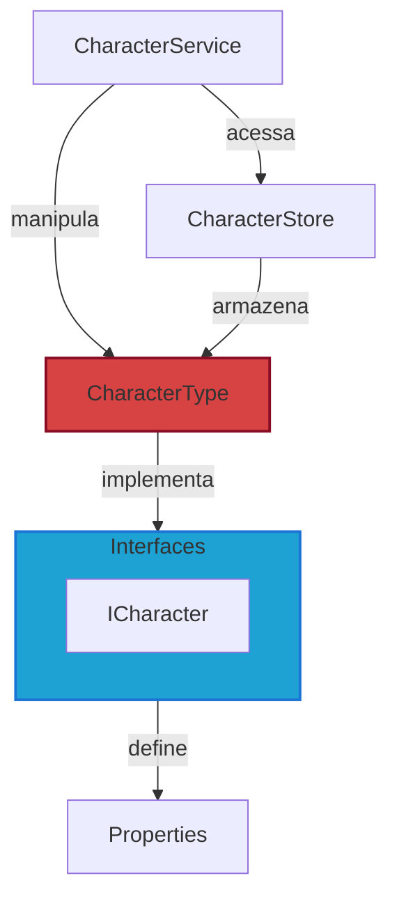
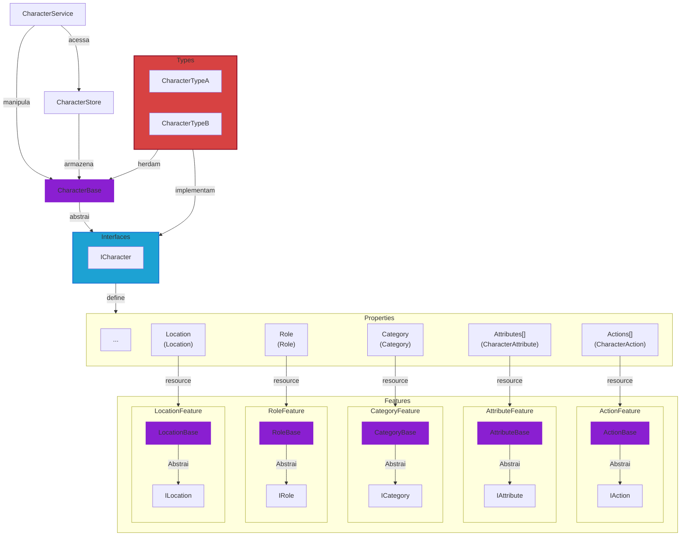

# Resources

A criação das informações do projeto (personagens, atributos, classes, ações, efeitos, etc.) é feita através dos Resources do Godot, que funcionam como containers para armazenamento desses dados.

Os Resources podem ser editados pela interface do Godot, carregados nas cenas (Nodes) e são acessados / manipulados in game através dos `Services` e das `Stores`.

Até o momento os tipos de Resources ainda estão sendo definidos e, por isso, deve existir apenas um para cada feature, sendo que o acesso e manipulação desses tipos estão sendo feitos de forma direta.

:::info Explicação

- `CharacterType` é o tipo de Resource que implementa as interfaces `ICharacter`;
- `CharacterService` manipula `CharacterType`;
- `CharacterStore` armazena `CharacterType`.

:::

:::tip Dica

Para um melhor entendimento do que é um Resource, veja o [tutorial](https://docs.godotengine.org/en/stable/tutorials/scripting/resources.html) e a [documentação](https://docs.godotengine.org/en/stable/classes/class_resource.html) do Godot.

:::

## Abstração

A partir do momento que novos tipos de Resources forem criados para uma mesma feature, como `CharacterTypeA` e `CharacterTypeB`, será necessário que essas classes herdem uma classe abstrata como `CharacterBase`.

No gráfico abaixo, `CharacterBase` é a classe herdada e que abstrai as interfaces de `ICharacter`.

:::info Explicação

- `CharacterTypeA` e `CharacterTypeB` são os tipos de Resource que herdam `CharacterBase`;
- `CharacterBase` é a classe abstrata que herda as interfaces de `ICharacter`;
- `CharacterService` manipula os dados tipo `CharacterBase`;
- `CharacterStore` armazena dados do tipo `CharacterBase`.

:::
