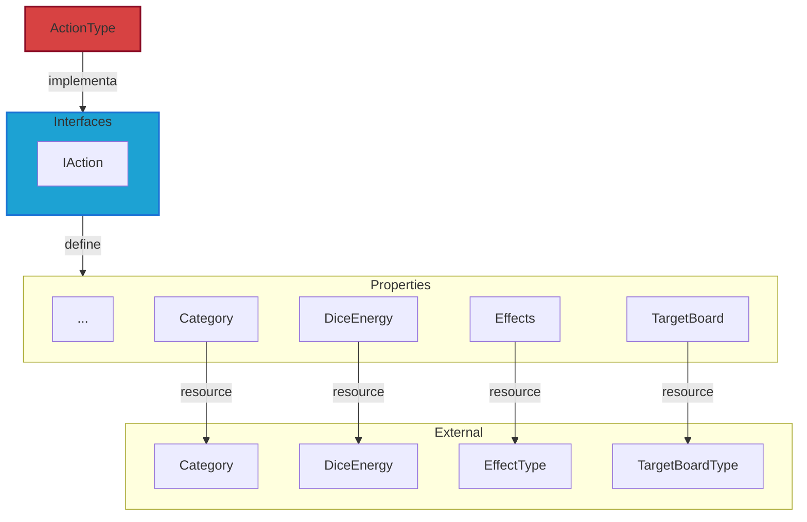

# Actions

**Actions** são entidades que representam as ações que podem ser realizadas pelos personagens no jogo.

Para mais detalhes, veja a [Referência de API](../../api/DiceRolling.Actions.md).

## Visão Geral

As ações no jogo são utilizadas para definir o que os personagens podem fazer. Cada ação possui uma categoria (`Category`), energia necessária (`DiceEnergy`), efeitos (`Effects`) e um alvo (`TargetBoard`).

:::warning Atenção

Os tipos de Resources irão alterar conforme o projeto evoluir. Para mais detalhes, veja sobre os [Resources](../../architecture/00-intro/resources.md).

:::

---

## Interfaces

- **IAction**: define as entidades de ações que são realizadas por personagens do jogo e agrega as interfaces:
  - **IIdentifiable**: define uma ID única.
  - **IActionInformation**: informações gerais de uma ação.
  - **IActionAssets**: recursos visuais de uma ação.
  - **IActionBehavior**: comportamento de uma ação.
  - **IActionContext**: contexto de uma ação.
  - **IActionResult**: resultado de uma ação.

---

## Types (Resources)

- **ActionType**: Representa um tipo de ação no jogo e inclui suas informações, comportamento, categoria, contexto e efeitos. Esta classe também fornece métodos para gerenciar esses aspectos.

### Types externos

- **Category**: categoria da ação.
- **DiceEnergy**: energia necessária para realizar a ação.
- **Effects**: efeitos da ação.
- **TargetBoard**: configuração do alvo da ação.

---

## Services

N/A

---

## Stores

N/A
