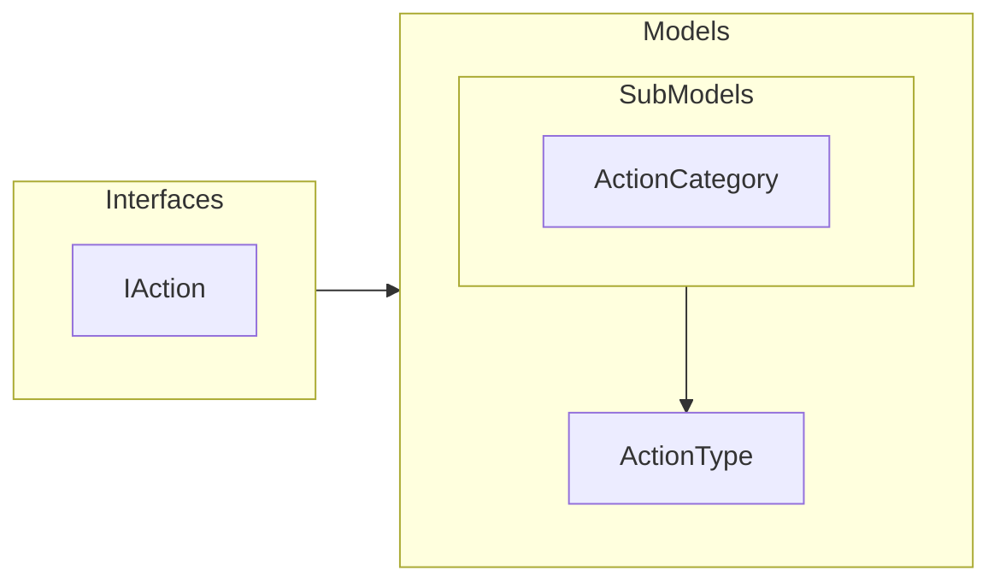

# Actions

**Actions** são entidades que representam as ações que podem ser realizadas pelos personagens no jogo.

Para mais detalhes, veja a [Referência de API](../../api/DiceRolling.Actions.md).

## Arquitetura

---

## Interfaces

- **IAction**: define as entidades de ações que são realizadas por personagens do jogo e agrega as interfaces:
  - **IActionAssets**: recursos visuais de uma ação.
  - **IActionBehavior**: comportamento de uma ação.
  - **IActionCategory**: categoria de uma ação.
  - **IActionInformation**: informações gerais de uma ação.
  - **IActionContext**: contexto de uma ação.

---

## Models

- **ActionType**: Representa um tipo de ação no jogo e inclui suas informações, comportamento, categoria, contexto e efeitos. Esta classe também fornece métodos para gerenciar esses aspectos.

### Sub Models

- **ActionCategory**: Categoria de uma ação.
