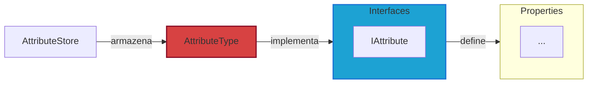

# Attributes

**Attributes** são as características que definem os atributos dos personagens no jogo.

Para mais detalhes, veja a [Referência de API](../../api/DiceRolling.Attributes.md).

## Visão Geral

Os atributos no jogo definem as características dos personagens.

:::warning Atenção

Os tipos de Resources irão alterar conforme o projeto evoluir. Para mais detalhes, veja sobre os [Resources](../../architecture/00-intro/resources.md).

:::

---

## Interfaces

- **IAttribute**: define um atributo no jogo e agrega as interfaces:
  - **IIdentifiable**: define uma ID única.
  - **IAttributeInformation**: informações básicas de um atributo.
  - **IAttributeAssets**: recursos visuais de um atributo.
  - **IAttributeValues**: valores de um atributo.

---

## Models

- **AttributeType**: Representa um tipo de atributo no jogo e inclui suas informações e valores. Esta classe também fornece métodos para inicializar e gerenciar esses aspectos.

---

## Services

N/A

---

## Stores

- **AttributeStore**: Armazena dados dos atributos em coleções e facilita a manipulação desses atributos.
