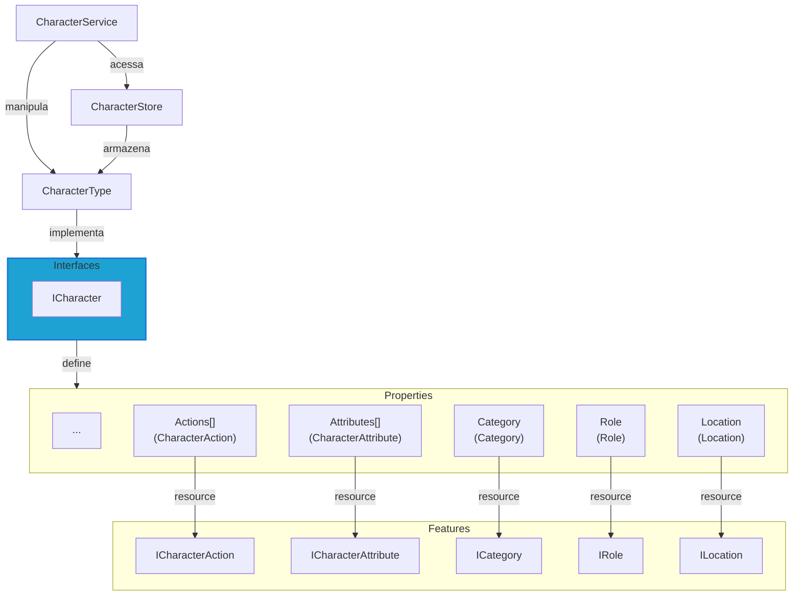

# Characters

**Characters** são entidades que representam os personagens **jogáveis e não-jogáveis** no jogo.

Para mais detalhes, veja a [Referência de API](../../api/DiceRolling.Characters.md).

## Visão Geral

---

## Interfaces

- **ICharacter**: define um personagem no jogo e agrega as interfaces:
  - **IIdentifiable**: define uma ID única.
  - **ICharacterInformationSheet**: informações gerais de um personagem e categoria.
  - **ICharacterAssetSheet**: recursos visuais de um personagem.
  - **ICharacterRoleSheet**: role de um personagem.
  - **ICharacterActionSheet**: ações de um personagem.
  - **ICharacterAttributeSheet**: atributos de um personagem.
  - **ICharacterPlacementSheet**: localização de um personagem.

---

## Types (Resources)

- **CharacterType**: Representa um tipo de personagem no jogo e inclui suas informações, atributos, ações, recursos visuais, localização e papel. Esta classe também fornece métodos para inicializar e gerenciar esses aspectos.

  

### External Properties

- **Category**: Categoria do personagem.
- **CharacterRole**: Role do personagem.
- **CharacterAction**: Ação do personagem.
- **CharacterAttribute**: Atributo do personagem.
- **CharacterPlacement**: Localização do personagem.

---

## Services

- **CharacterService**: Fornece métodos para manipulação dos dados de personagens.

---

## Stores

- **CharacterStore**: Armazena dados dos personagens em coleções e facilita a manipulação desses personagens.
