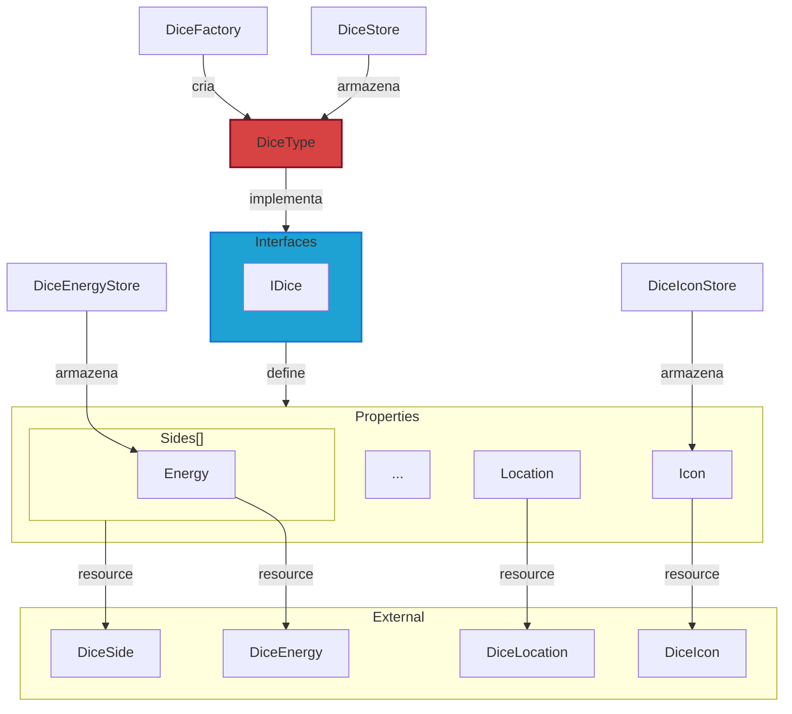

# Dice

**Dice** são entidades que representam os dados utilizados no jogo.

Para mais detalhes, veja a [Referência de API](../../api/DiceRolling.Dice.md).

## Visão Geral

Os dados são utilizados para gerar aleatoriamente a energia será usada pelos personagens para que consigam executar ações.

Cada dado possui um conjunto de lados (`DiceSide`), uma localização (`DiceLocation`) e energias associadas (`DiceEnergy`).

:::warning Atenção

Os tipos de Resources irão alterar conforme o projeto evoluir. Para mais detalhes, veja sobre os [Resources](../../architecture/00-intro/resources.md).

:::

## Interfaces

- **IDice**: define as entidades de dados e agrega as interfaces:
  - **IIdentifiable**: define uma ID única.
- **IDiceEnergy**: define as energias associadas a um dado.
- **IDiceIcon**: define os ícones associados a um dado.

### Enumerators

- **DiceLocationCategory**: Categorias de localização do dado.

## Types (Resources)

- **DiceType**: Representa um tipo de dado no jogo e inclui suas informações, lados, localização e energias. Esta classe também fornece métodos para inicializar e gerenciar esses aspectos.

- **DiceIcon**: Representa um ícone associado a um dado.

### Types externos

- **DiceSide**: Representa um lado do dado.
- **DiceEnergy**: Energia associada ao lado do dado.
- **DiceLocation**: Localização do dado.

## Services

- **DiceFactory**: Fornece métodos para criar diferentes tipos de dados (D4, D6, D8, D10, D12, D20, D100).

## Stores

- **DiceStore**: Armazena os dados em coleções;
- **DiceEnergyStore**: Armazena dados das energias dos dados em coleções;
- **DiceIconStore**: Armazena dados dos ícones dos dados em coleções.
