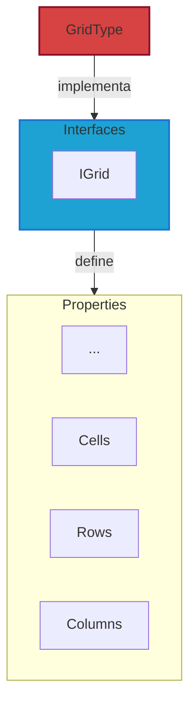

# Grids

Grids são estruturas compostas por células fundamentais no jogo, utilizadas para organizar e gerenciar a disposição dos elementos no campo de batalha.

Para mais detalhes, veja a [Referência de API](../../api/DiceRolling.Grids.md).

:::warning Atenção

Os tipos de Resources irão alterar conforme o projeto evoluir. Para mais detalhes, veja sobre os [Resources](../../architecture/00-intro/resources.md).

:::

---

## Interfaces

- **IGrid**: Define uma grid no jogo e agrega as interfaces:
  - **IRows**: Define o número de linhas na grid.
  - **IColumns**: Define o número de colunas na grid.
  - **ICells**: Representa as células individuais da grid.

### Enumerators

- **GridDirection**: Define a direção de uma grid.

---

## Types (Resources)

- **GridType**: Representa um tipo de grid no jogo e inclui suas propriedades, como células, linhas e colunas.
- **GridCell**: Representa uma célula individual na grid.

### Types externos

N/A

---

## Services

- **GridService**: Fornece métodos para manipulação dos dados das grids.

---

## Stores

N/A
