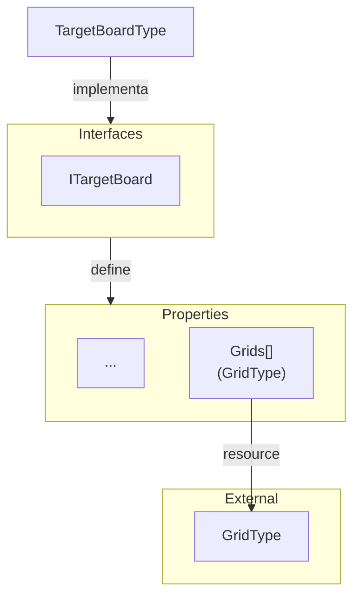

# Target

**Target** são entidades que representam os tabuleiros de alvos utilizados no jogo.

Para mais detalhes, veja a [Referência de API](../../api/DiceRolling.Targets.md).

## Visão Geral

Os alvos no jogo representa uma configuração de grids (`GridType`) dos alvos que as ações podem atingir.

## Interfaces

- **ITargetBoard**: define um tabuleiro de alvos no jogo e agrega as interfaces:
  - **IIdentifiable**: define uma ID única.
  - **IGrid**: define a configuração de grids de um tabuleiro de alvos.

### Enumerators

N/A

---

## Types (Resources)

- **TargetBoardType**: Representa um tipo de tabuleiro de alvos no jogo e inclui suas informações e configuração de grids.

### Types externos

- **GridType**: Configuração de grids associada a um tabuleiro de alvos.

---

## Services

- **TargetBoardService**: Fornece métodos para manipulação dos dados dos tabuleiros de alvos.

---

## Stores

N/A
