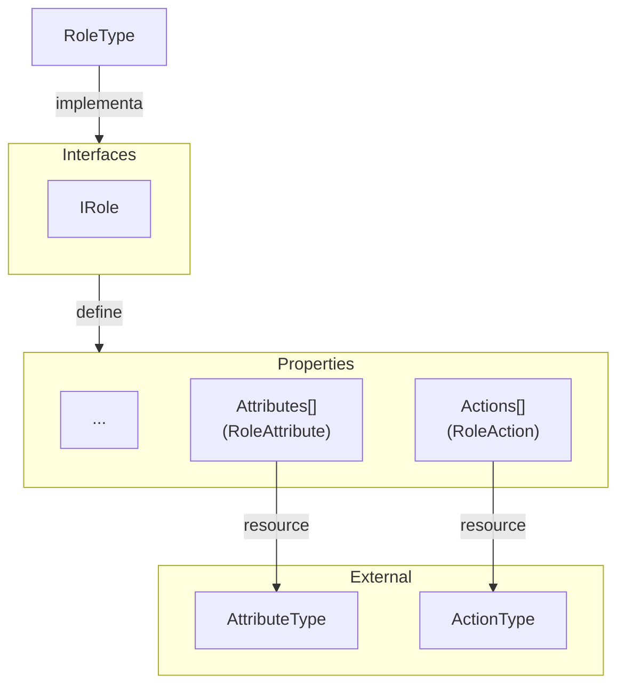

# Roles

**Roles** são entidades que representam os papéis que os personagens podem assumir no jogo.

Para mais detalhes, veja a [Referência de API](../../api/DiceRolling.Roles.md).

## Visão Geral

Os papéis no jogo definem os atributos e ações que os personagens podem ter. Cada papel possui um conjunto de atributos (`RoleAttribute`) e ações (`RoleAction`).

## Interfaces

- **IRole**: define um papel no jogo e agrega as interfaces:
  - **IIdentifiable**: define uma ID única.
  - **IRoleAttributes**: define os atributos de um papel.
  - **IRoleActions**: define as ações de um papel.

### Enumerators

N/A

---

## Types (Resources)

- **RoleType**: Representa um tipo de papel no jogo e inclui suas informações, atributos e ações.

### Types externos

- **RoleAttribute**: Atributo associado a um papel.
- **RoleAction**: Ação associada a um papel.

---

## Services

N/A

---

## Stores

N/A
