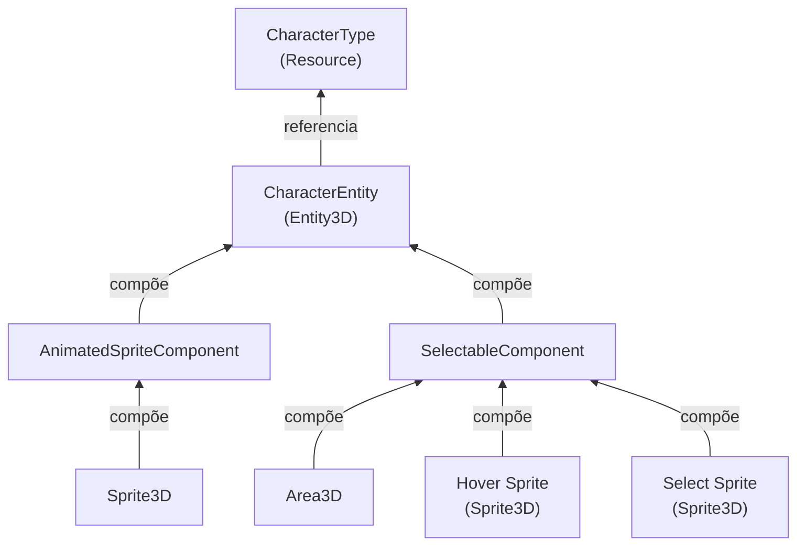

# Character Renderer

## Visão Geral

O Character Renderer é responsável pela representação visual dos personagens, conectando os modelos de dados `CharacterType` com elementos visuais na cena.

## Entidades

### CharacterEntity

- Herda de `Entity3D` e representa visualmente um personagem
- Encapsula um modelo de dados `CharacterType`
- Responde a mudanças nos dados através do método `NotifyUpdate()`
- Permite interação com o sistema de grid através de componentes

## Componentes

### AnimatedSpriteComponent

- Renderiza o sprite do personagem usando os recursos visuais definidos no `CharacterType`
- Gerencia animações como idle

### SelectableComponent

- Adiciona funcionalidade de seleção ao personagem
- Gerencia indicadores visuais (hover, seleção)
- Emite sinais quando o personagem é selecionado/desselecionado

## Interações com Outros Sistemas

- Interage com `GridSystem` para posicionamento
- Recebe atualizações de estado do `CharacterService`
