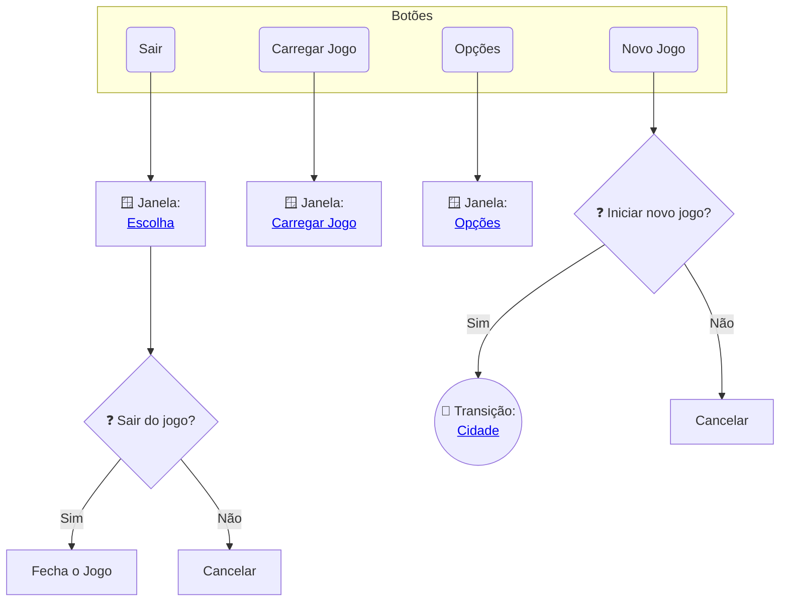

import ZoomableDiagram from "@site/src/components/ZoomableDiagram";
import FullscreenGallery from "@site/src/components/FullscreenGallery";

# Fluxo de Telas

Esse documento descreve o fluxo de telas do jogo, indicando as transições entre as cenas e as ações que podem ser realizadas em cada uma delas.

:::tip Dica
Clique nos links para navegar entre os diagramas.
:::

---

## MENUS

### Menu Principal

Primeira tela do jogo, onde o jogador pode iniciar ou carregar uma sessão de jogo, acessar as opções ou sair do jogo.

<ZoomableDiagram>



</ZoomableDiagram>

### Game Over

Tela exibida ao final de uma sessão de jogo, onde o jogador pode carregar um jogo salvo, voltar ao menu principal ou sair do jogo.

<ZoomableDiagram>

    ```mermaid
    flowchart TB
        %% Botões
        subgraph GameOverButtons["Botões"]
            LoadGameButton("Carregar Jogo")
            MainMenuButton("Menu Principal")
            ExitButton("Sair")
        end

        %% Decisões
        MainMenuQuestion{"❓ Voltar ao Menu Principal?"}
        CloseGameQuestion{"❓ Sair do jogo?"}

        %% Caminhos
        MainMenuTransition(("🔀 Transição:<br><a href='#menu-principal'>Menu Principal</a>"))

        LoadGameWindow["🪟 Janela: <br><a href='#janela-carregar-jogo'>Carregar Jogo</a>"]

        ExitChoiceWindow["🪟 Janela: <br><a href='#janela-escolha'>Escolha</a>"]

        %% Fluxo
        LoadGameButton --> LoadGameWindow

        MainMenuButton --> MainMenuQuestion
        MainMenuQuestion -->|Sim| MainMenuTransition
        MainMenuQuestion -->|Não| CancelMainMenu["Cancelar"]

        ExitButton --> ExitChoiceWindow
        ExitChoiceWindow --> CloseGameQuestion
        CloseGameQuestion -->|Sim| Exit["Fecha o Jogo"]
        CloseGameQuestion -->|Não| CancelCloseGame["Cancelar"]
    ```

</ZoomableDiagram>

---

## GAMEPLAY

Após iniciar uma sessão (novo jogo ou carregar jogo salvo), o jogador é levado para a cidade.

### Cidade

Funciona como um hub onde o jogador pode realizar diversas ações relacionadas ao gerenciamento dos personagens, equipamentos e, também, pode escolher uma dungeon para explorar.

Para mais detalhes, veja [sobre a cidade](../features/scenes/city).

<FullscreenGallery
  images={[
    {
      image: "/game_design/screen_flow/city/darkest_dungeon.png",
      title: "Darkest Dungeon",
    },
    {
      image: "/game_design/screen_flow/city/iratus.png",
      title: "Iratus: Lord of the Dead",
    },
  ]}
/>

<ZoomableDiagram>

    ```mermaid
    flowchart TB
        %% Botões
        subgraph CityButtons["Botões"]
            subgraph Buildings["Estruturas"]
                BuildingsList["Lista de Estruturas"]
            end

            TroopButton["Gerenciar Tropa"]
            InventoryButton["Gerenciar Inventário"]
            ChooseDungeonButton["Escolher Dungeon"]

            subgraph CityOptions["Botões Auxiliares"]
                SaveGameButton["Salvar Jogo"]
                OptionsButton["Opções"]
                MainMenuButton["Voltar ao Menu Principal"]
            end
        end

        %% Decisões
        MainMenuQuestion{"❓ Voltar ao Menu Principal?"}

        %% Caminhos
        TroopWindow["🪟 Janela: <br><a href='#gerenciar-tropa'>Gerenciar Tropa</a>"]
        InventoryWindow["🪟 Janela: <br><a href='#janela-gerenciar-inventário'>Gerenciar Inventário</a>"]
        ChooseDungeonWindow["🪟 Janela: <br><a href='#escolher-dungeon'>Escolher Dungeon</a>"]

        MainMenuTransition(("🔀 Transição:<br><a href='#menu-principal'>Menu Principal</a>"))
        OptionsWindow("🪟 Janela: <br><a href='#janela-opções'>Opções</a>")

        %% Fluxo
        TroopButton --> TroopWindow
        InventoryButton --> InventoryWindow
        ChooseDungeonButton --> ChooseDungeonWindow

        MainMenuButton --> MainMenuQuestion
        MainMenuQuestion -->|Sim| MainMenuTransition
        MainMenuQuestion -->|Não| CancelMainMenu["Cancelar"]

        OptionsButton --> OptionsWindow

    ```
</ZoomableDiagram>

#### Gerenciar Tropa

#### Escolher Dungeon

### Dungeon

#### Mapa

<FullscreenGallery
  images={[
    {
      image: "/game_design/screen_flow/dungeon/slay_the_spire.png",
      title: "Slay the Spire",
    },
  ]}
/>

<ZoomableDiagram>

    ```mermaid
    flowchart TD
        %% Botões
        subgraph DungeonMapButtons["Botões"]
            subgraph DungeonMap["🗺️ Mapa da Dungeon"]
                Rooms["📍 Salas"]
            end

            EnterRoomButton["➡️ Entrar na Sala"]
            ExitButton["🐔 Abandonar Dungeon"]
            OptionsButton["⚙️ Opções"]
            GameLogButton["📜 Log do Jogo"]
        end

        %% Decisões
        ExitDungeonChoice{"❓ Abandonar Dungeon?"}

        %% Caminhos
        EnterRoomWindow["🪟 Janela: <br><a href='#janela-escolha'>Escolha</a>"]
        OptionsWindow["🪟 Janela: <br><a href='#janela-opções'>Opções</a>"]
        GameLogWindow["🪟 Janela: <br><a href='#janela-game-log'>Log do Jogo</a>"]
        MainMenuTransition(("🔀 Transição:<br><a href='#menu-principal'>Menu Principal</a>"))

        %% Fluxo
        EnterRoomButton --> EnterRoomWindow
        ExitButton --> ExitDungeonChoice

        OptionsButton --> OptionsWindow
        GameLogButton --> GameLogWindow

        ExitDungeonChoice -->|Sim| MainMenuTransition
        ExitDungeonChoice -->|Não| CancelExitDungeon["Cancelar"]

    ```

</ZoomableDiagram>

#### Sala de Evento

#### Sala de Combate

---

## JANELAS 🪟

"Janelas" são cenas que podem ser acessadas em mais de um lugar do jogo.

### Janela: Gerenciar Inventário

### Janela: Escolha

<ZoomableDiagram>

    ```mermaid
    flowchart TD
        subgraph ChoiceWindow["Escolha"]
            NoButton["Não"]
            YesButton["Sim"]
        end

        YesButton --> Exit["Confirma ação"]
        NoButton --> Cancel["Cancela Ação"]
    ```

</ZoomableDiagram>

### Janela: Opções

### Janela: Salvar Jogo

### Janela: Carregar Jogo
