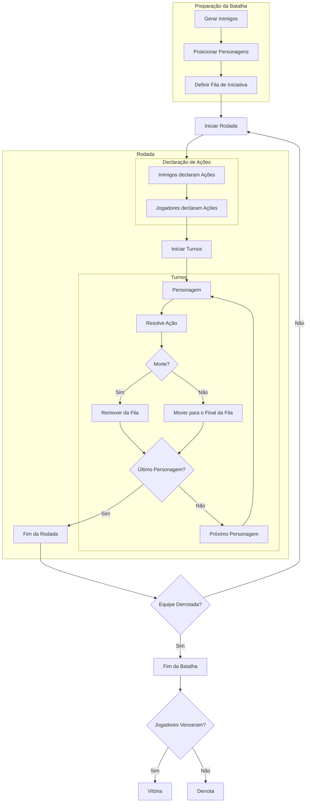

import ZoomableDiagram from "@site/src/components/ZoomableDiagram";

# Fluxo de Batalha

<ZoomableDiagram>

</ZoomableDiagram>

## Preparação da Batalha

1. Os inimigos são gerados e exibidos para o jogador.
2. Os personagens do jogador são posicionados no campo de batalha.
3. A fila de iniciativa é definida, organizando todos os personagens e inimigos.
4. A batalha começa.

## Rodadas

### Declaração de Ações

1. Os inimigos revelam suas ações e alvos.
2. O jogador escolhe as ações e alvos de cada um dos seus personagens.
3. Após todas as ações serem declaradas, os turnos são resolvidos.

#### Pré-visualização de Ações

Durante a declaração de ações, o jogador pode **pré-visualizar** os resultados das ações de seus personagens e dos inimigos. Isso permite ajustar sua estratégia antes da execução das ações.

Por exemplo, ao selecionar um inimigo como alvo, o jogador pode ver **o dano estimado** e **quaisquer efeitos colaterais** que a ação possa causar. Da mesma forma, pode verificar o impacto das ações inimigas e tentar mitigar seus efeitos.

### Turnos

#### Execução dos Turnos

1. Começando pelo primeiro personagem na fila de iniciativa, cada personagem executa sua ação.
2. Se um personagem morrer como resultado de uma ação, ele é removido do campo de batalha e da fila antes de agir.
3. Após executar sua ação, o personagem é movido para o final da fila de iniciativa.

### Fim da Rodada

- A rodada termina quando todos os personagens na fila de iniciativa tiveram seu turno.
- Em seguida, verifica-se as condições de fim da batalha:

  1. **Vitória**: Se todos os inimigos forem derrotados, o jogador vence e recebe recompensas.
  2. **Derrota**: Se todos os personagens do jogador forem derrotados, a batalha termina com um game over.
  3. **Continuação**: Se ambos os lados ainda tiverem personagens vivos, uma nova rodada começa.
