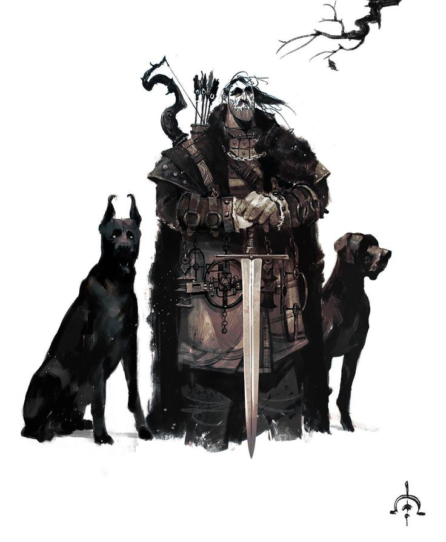
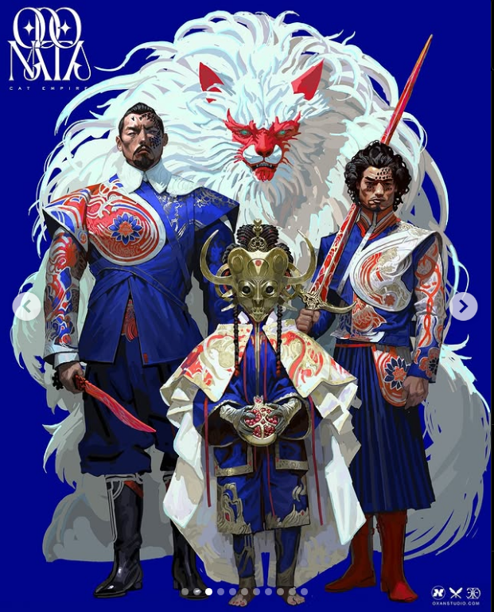
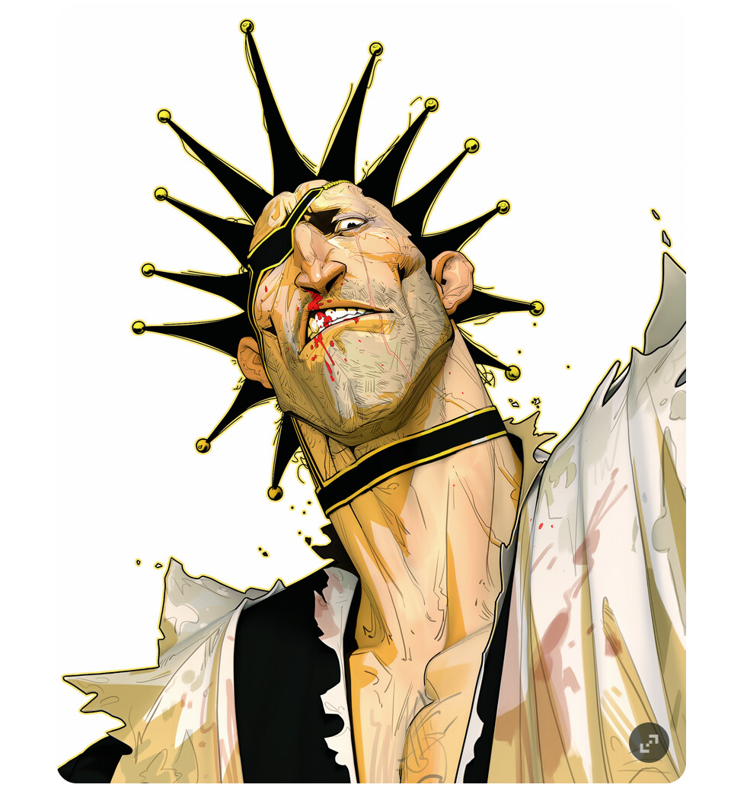
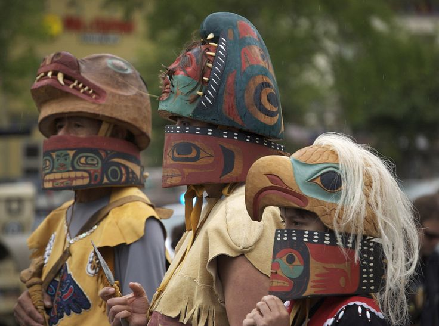
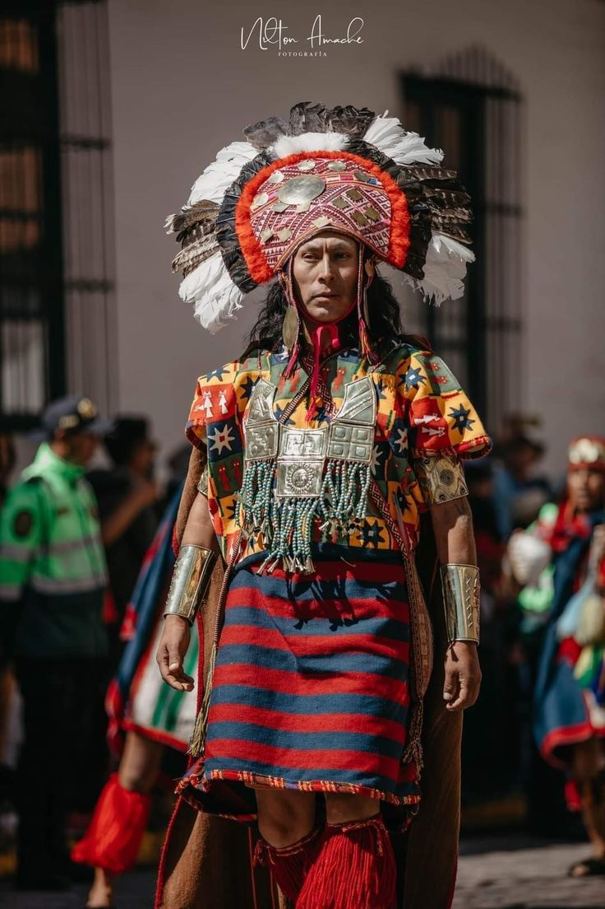
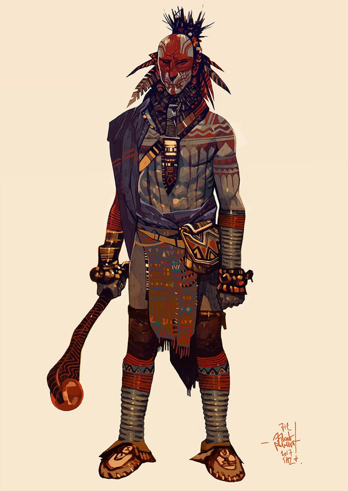
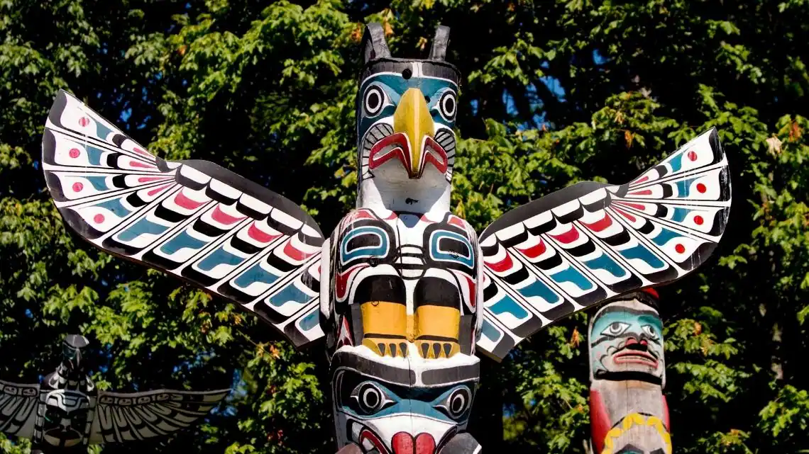
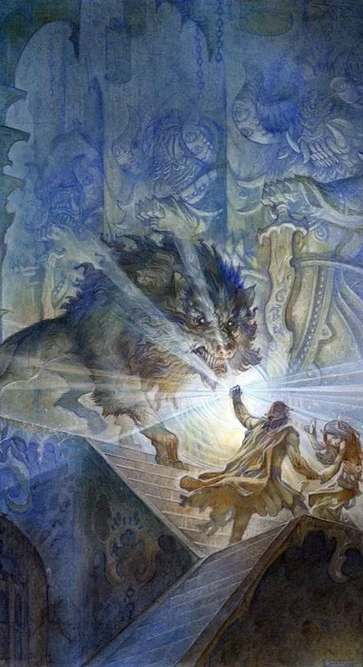

# Arte e Estilo Visual

## Visão Geral

### Anatomia e Proporções

Os personagens terão anatomia e proporções estilizadas, refletindo simbolicamente os arquétipos de cada classe. Guerreiros e Tanks serão de estatura mais baixa, porém com corpos robustos e musculosos, destacando sua resistência e capacidade de proteger aliados. Rogues terão silhuetas mais esguias e ágeis, com traços que enfatizam sua natureza furtiva e destreza em combate. Magos e Curandeiros, por sua vez, possuirão uma aparência mais delicada e magra, com detalhes que reforçam sua sabedoria e conexão espiritual, como gestos refinados e uma postura contemplativa.

Essa abordagem visual serve para reforçar a narrativa e a identidade de cada classe dentro do universo do jogo.

### Paleta de cores

O uso de cores será dividido entre tons vibrantes para criar contraste e capturar a atenção, enquanto tons neutros servirão como base para equilibrar a composição visual. Pequenos detalhes em dourado ou metálico destacarão elementos importantes, como líderes, itens mágicos ou divindades.
Composições equilibrarão blocos grandes de cores sólidas com detalhes intrincados, como padrões geométricos inspirados em tecidos e cerâmicas tradicionais.

### Acabamento

As áreas principais dos personagens e cenários serão preenchidas com cores sólidas e vibrantes, permitindo um contraste marcante que facilita a leitura visual.

O sombreamento “core” será aplicado em um valor chapado. Enquanto as áreas iluminadas terão texturas suaves e leves gradientes, simulando pinceladas de aquarela, conferindo profundidade. para preservar o contraste com as cores chapadas.

## Referências Culturais e Históricas

### Culturas e Mitologias

A estética e narrativa do jogo são fortemente influenciadas pelas culturas indígenas da América, abrangendo as civilizações asteca e maia, os povos brasileiros como os tupi e guaranis, e até as tribos norte-americanas como os cherokees. Cada uma dessas culturas fornece um rico repertório de simbolismos, mitologias e tradições, que serão reinterpretadas e adaptadas para criar um universo de fantasia coeso e épico.

### Inspiração Cultural

- **Astecas e Maias**: Elementos como pirâmides escalonadas, calendários cerimoniais, máscaras rituais e deuses associados a forças da natureza servirão como base para arquiteturas, trajes e magias.
- **Tupi e Guaranis**: Mitos como o da criação da terra, figuras espirituais como os pajés e as conexões profundas com a fauna e flora influenciarão o design de personagens e narrativas místicas.
- **Cherokees e Norte-Americanos**: Motivos como símbolos totêmicos, contos sobre espíritos animais e o uso cerimonial de cores e padrões serão adaptados ao jogo.

### Adaptação para o Universo de Fantasia

Assim como Tolkien utilizou mitologias nórdica, celta e cristã para criar um épico que transcendesse suas influências diretas, este universo será desenvolvido para ser um **épico local**, reinterpretando e amalgamando as mitologias e culturas indígenas. As adaptações seguirão três princípios:

- **Mitologias Reimaginadas**: Divindades, heróis e monstros serão criados a partir de conceitos baseados nas culturas mencionadas, mas ajustados para formar uma cosmologia única. Por exemplo, um deus asteca do sol pode ser transformado em um governante celestial que concede poderes mágicos a certos clãs.

- **Narrativa Épica**: A história será estruturada em torno de ciclos míticos e históricos, com temas de criação, destruição e renascimento. Esses ciclos formarão a base para a lore do mundo, como os Silmarils e as batalhas do Legendarium de Tolkien.

- **Representação Simbólica**: Os aspectos visuais (arquitetura, vestimentas, armas) e narrativos (rituais, tradições, idioma) não serão reproduções literais, mas sim representações estilizadas que capturam o espírito e o simbolismo cultural.

## Animações e Efeitos Visuais
